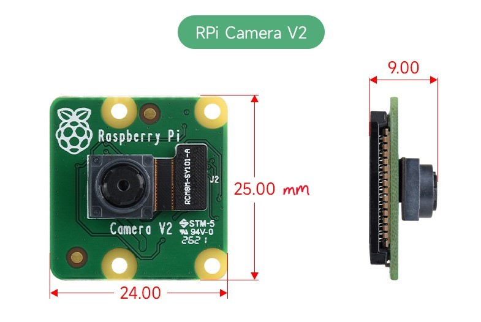

# Derivation of Camera Parameters

### Raspberry Pi Camera V2 Specs

| Model               | RPi Camera V2                          |
| ------------------- | -------------------------------------- |
| Sensor              | Sony IMX219PQ                          |
| Pixels              | 8MP $(3280 \times 2464$)               |
| CMOS Size           | 3.674 x 2.760 mm (1/4 inch format)     |
| Pixel Size          | $1.12 \times 1.12 \, \mu m$            |
| Aperture            | f/2.0                                  |
| Focal Length        | 3.04 mm                                |
| Field/Angle of View | $62.2^{\degree} \times 48.8^{\degree}$ |
| Video Record        | 1080p30, 720p60, and 640 x 480p90      |
| Dimension           | $25 \times 23.86 \times 9$ mm          |
| SLR lens equivalent | 29 mm                                  |
[Reference](https://elinux.org/Rpi_Camera_Module#Technical_Parameters_.28v.2_board.29)

### Intrinsic Parameters

**intrinsic parameter matrix:**
$$K = \begin{bmatrix}
    f_{x} & \gamma & c_{x} \\
    0 & f_{y} & c_{y} \\
    0 & 0 & 1
\end{bmatrix}$$
where
- $f_{x}$ and $f_{y}$ are the focal lengths in pixels
	- for focal length $f$ and pixel sizes $p_x$ and $p_y$ ,
$$f_x = \frac{f}{p_x}, \quad f_y = \frac{f}{p_y}$$
- $c_x$ and $c_y$ are the camera focal point
	- for a focal/principal point assumedly at the center of the sensor, given resolution (W, H),
$$c_x = \left\lfloor\frac{W}{2}\right\rfloor, \quad c_y = \left\lfloor\frac{H}{2}\right\rfloor$$
- $\gamma$ is the skew parameter
	- typically 0 for square pixels, as in the case of the IMX219 sensor, so:
	$$\gamma = 0$$
Given
- focal length $f = 3.04$ mm
- IMX219 pixel sizes $p_x = p_y = 1.12 \, \mu m = 1.12 \times 10^{-3} \, mm$
- resolution $W = 3280$ and $H=2464$
We have intrinsic parameter matrix with 3 digits of precision:
$$K = \begin{bmatrix}
    2714.286 & 0 & 1640 \\
    0 & 2714.286 & 1232 \\
    0 & 0 & 1
\end{bmatrix}.$$
We also have field of view provided above, henceforth called
$$\theta_{x} = 62.2^{\degree}, \quad \theta_{y} = 48.8^{\degree}$$

### Radial Distortion Coefficients

We model radial distortion as the 5th order odd polynomial with distortion coefficients $k_1$ and $k_2$ :
$$r^{\prime} = r(1 + k_{1}r^{2} + k_{2}r^{4})$$
Since the aperture model is $f/2.0$, we expect barrel distortion, from initial estimates of other IMX219 sensors, we initially choose
$$k_{1} \approx -0.35, \quad k_{2} \approx 0.25$$

**!!FINISH LATER!!** - use script to find best least-squares fit

### Extrinsic Parameters

Extrinsic parameters relate the camera to the world by augmented matrix $[R ∣ t]$ where
- **`R` (Rotation)**: Identity matrix (default calibration).
- **`t` (Translation)**: Depends on camera mounting.
For initial calibration, we assume $R = I_{3}$ and $t=0$.